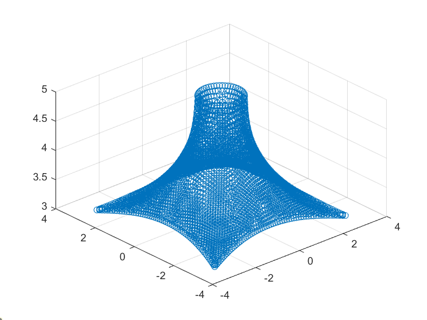
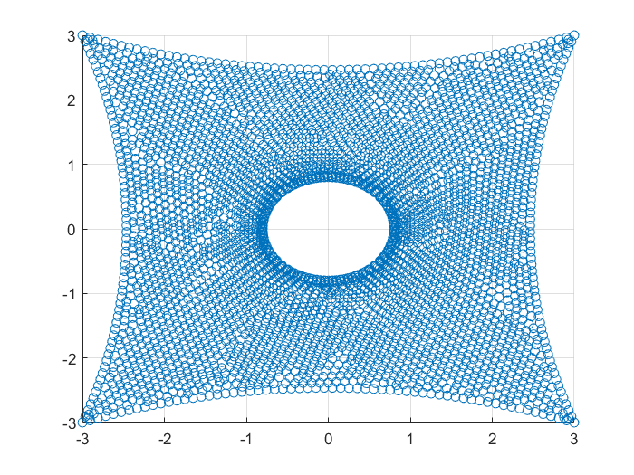

# Surface Postprocessing
Aiming to present pressure and displacement measurements on irregular surfaces.

## 1. Generating the files
/`run_generate_output.py`/

The data to be used for plotting are generated and stored in Hierarchical Data Format (HDF5), which are optimize to contain large amounts of data.

For the moment, the test [Ackley function](https://en.wikipedia.org/wiki/Test_functions_for_optimization) is used to replicate the pressure values.

## 2. Data postprocessing
The data are provided in a discrete, randomly distributed pattern. In order to achieve a regular grid for plotting, it was decided to **interpolate** the available values.

Scipy offers a wide range of different interpolators, not only for one-dimensional data arrays but also for multiple dimensions. Many of them, though, require that the data provided are strictly ascending or descending. The geometry data available are not sorted and it is probably not possible to simultaneously sort the X and Y values. Since this condition will never be met, a function which does not require this must be found. `LinearNDInterpolator` is one of them.

## 3. Plotting the surface
#### 3D-Scatterplot
The first, simplest approach was to perform a scatterplot of the geometry with the available data in the .h5 files, so that the correctness and quality of the data could be checked.

From the top view, it became evident that the data are not evenly distributed over the space. This has motivated the previously explained interpolation.

#### 3D-Surface plot
The interpolated geometry (Z dimension) and pressure data (See `2. Data postprocessing`) can now be used in a regular grid. 

First, the grid is created between the minimum and maximum limits of the available X and Y geometry values with help of the function `np.meshgrid()`. Then, values of the interpolated function can be obtained for every point in the XY-meshgrid: `Z = F(X,Y)`, or `pressure = P(X,Y)`, where F and P are the respective interpolating functions.

## 4. Plotting values on the surface
#### Pressure data over the 3D-Surface plot
Once the 3D-Surface is created with the geometry data, the measured pressure data can be incorporated in the form of colours over the surface. Once the pressure field has been interpolated and a regular mesh has been created with it, it can be added as an additional parameter in the `plot_surface()` function.
