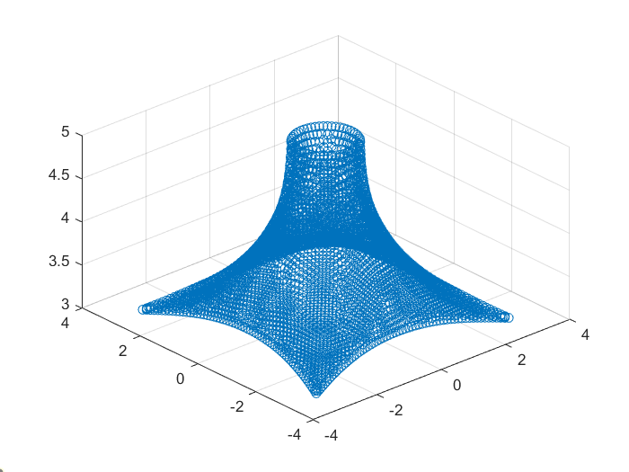
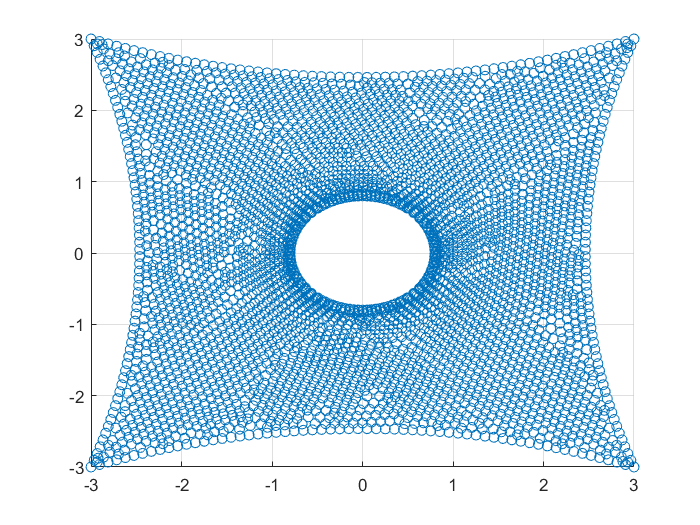
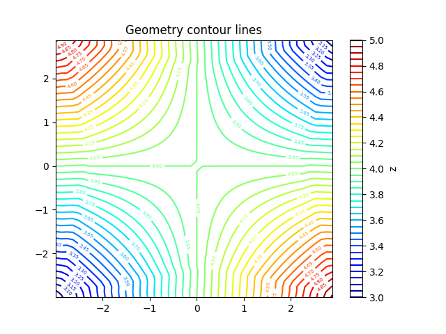
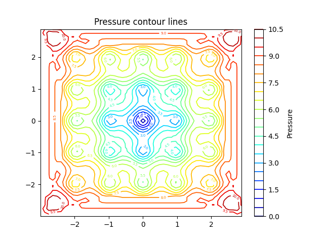
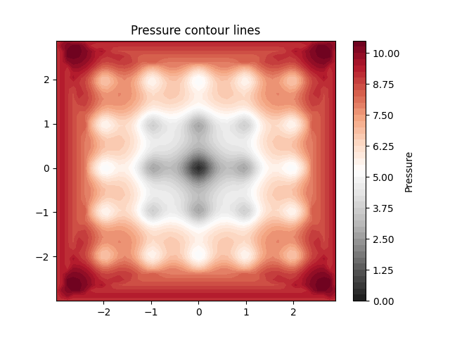
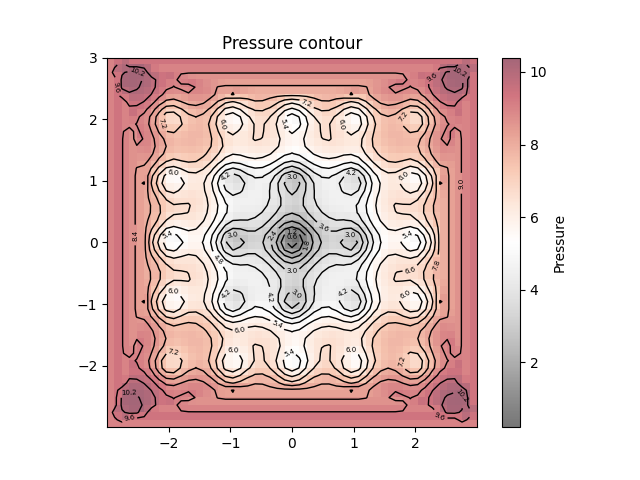
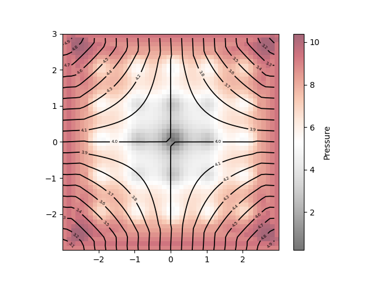

# Surface Postprocessing
Aiming to present pressure and displacement measurements on irregular surfaces.

## 1. Generating the files
/`run_generate_output.py`/

The data to be used for plotting are generated and stored in Hierarchical Data Format (HDF5), which are optimize to contain large amounts of data.

For the moment, the test [Ackley function](https://en.wikipedia.org/wiki/Test_functions_for_optimization) is used to replicate the pressure values.

## 2. Data postprocessing
The data are provided in a discrete, randomly distributed pattern. In order to achieve a regular grid for plotting, it was decided to **interpolate** the available values.

Scipy offers a wide range of different interpolators, not only for one-dimensional data arrays but also for multiple dimensions. Many of them, though, require that the data provided are strictly ascending or descending. The geometry data available are not sorted and it is probably not possible to simultaneously sort the X and Y values. Since this condition will never be met, a function which does not require this must be found. `LinearNDInterpolator` is one of them.

## 3. Plotting the surface
#### 3D-Scatterplot
The first, simplest approach was to perform a scatterplot of the geometry with the available data in the .h5 files, so that the correctness and quality of the data could be checked.

From the top view, it became evident that the data are not evenly distributed over the space. This has motivated the previously explained interpolation.

#### 3D-Surface plot
The interpolated geometry (Z dimension) and pressure data (See `2. Data postprocessing`) can now be used in a regular grid. 

First, the grid is created between the minimum and maximum limits of the available X and Y geometry values with help of the function `np.meshgrid()`. Then, values of the interpolated function can be obtained for every point in the XY-meshgrid: `Z = F(X,Y)`, or `pressure = P(X,Y)`, where F and P are the respective interpolating functions.

.png)

## 4. Plotting values on the surface
#### Pressure data over the 3D-Surface plot
Once the 3D-Surface is created with the geometry data, the measured pressure data can be incorporated in the form of colours over the surface. Once the pressure field has been interpolated and a regular mesh has been created with it, it can be added as an additional parameter in the `plot_surface()` function.

Note that, at this point, the Ackley function is being used to replicate the pressure data.

#### Isolines over the 3D-Surface plot
Apart from the possibility to represent data with colours, isolines can also be helpful. Matplotlib offers the `plt.contour()` function for this:

The parameters are still to be adjusted in order to obtain the desired result.

## 5. 2D-Plot (simple projection)
Plots have been generated with both geometry and pressure data independently.

#### Contour lines
As a starting point, a flat 2D projection has been created with purely geometric data. Contour lines have been used as in a topographic map.

When plotting pressure data, the result is the following:

The number of isolines can be manually increased or reduced. The most convenient function in this case is `plt.contour()`. The triangulation function `plt.tricontour()` can also be used, but the plot is not as clean as before.

#### Colormap

#### Colormap + contour lines

#### Combined plots
Pressure and geometry can be plotted simultaneously if needed, using a colormap and contour lines over it.

## Limitations & Further work

The tridimensional membrane structures are currently being represented on the flat plots through ordinary orthogonal projection. This only provides acceptable results for surfaces with low gradients. 

That is to say, structures like the hypar can be visualized without much distortion, but a more robust approach is needed for other surfaces like the cone if a flat plot is desired.

Several techniques are available to allow a 2D representation of a membrane structure. Based on literature research on the topic, the following approaches are proposed for this. Special attention has been paid to the Carat++ research code, developed by the Chair of Statik at the TU Munich.

- **Projection on a cylinder or sphere.**

- **Relaxation in the plane.**
This technique is based on the fact that membrane structures are typically pre-stressed in order to achieve structural stiffness and stability.
This involves applying tension to the membrane material, such as fabric or other flexible materials, before it is installed in the structure.
Combined with a biaxial curvature, efficient structures in terms of load distribution can be achieved.

- **"Cutting Pattern Generation".**
It consists of cutting the membrane structure into different parts in an optimized manner, such that they can be developed more easily into a flat surface.
Unlike the methods presented above, this technique has already been implemented in the Carat++ repository, which contains two modules which perform this procedure: `AnalysisCuttingPattern.cpp` and `Analysis_CutPart_VaReS.cpp`.
Although interesting, this approach is surface-specific and a general method would be harder to implement.

#### References

More detailed research and insights can be found in the following dissertations:

- "Numerisch-mechanische Betrachtung des Entwurfsprozesses von Membrantragwerken" (Johannes Linhard)
- "Numerical Methods for the Design and Analysis of Tensile Structures" (Falko H. Dieringer)
- "Variation of Reference Strategy Generation of Optimized Cutting Patterns for Textile Fabrics" (Armin M. Widhammer)
 
